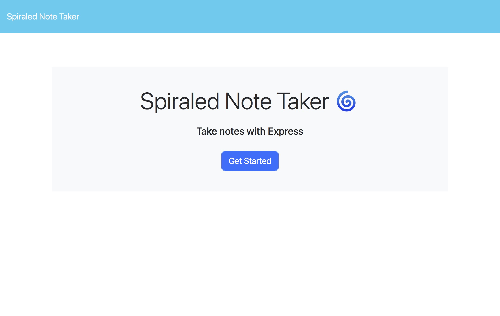
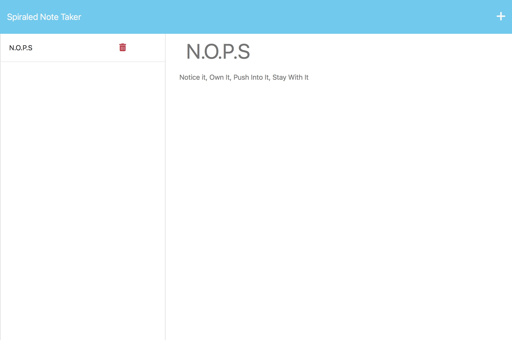

# spiraled-note-taker

## Description
Spiraled Note Taker replaces your old spiraled note book allowing you to take notes on the web using an express.js server to host the files.

## Table of Contents
- [Description](#description)
- [Installation](#installation)
- [Usage](#usage)
- [Preview](#preview)
- [License](#license)
- [Tests](#tests)
- [Questions](#questions)

## Installation
`git clone https://github.com/shindekokoro/spiraled-note-taker`

## Usage
1. Make any changes to `config.json` as needed
2. Install pm2 server to ensure daemonization of app to keep alive. Use the command below if you don't have pm2 installed.
   - `npm install pm2 -g`
3. `npm run start-pm2`
   - `npm run watch` to automatically restart on changes, only recommended for testing. Will cause unexpected behavior on live.
4. `npm run stop` or `pm2 stop sNotes` to stop

## Preview
[Heroku Deployed Link](https://spiraled-note-taker-231d6b6a70a7.herokuapp.com)

## License
[MIT](http://choosealicense.com/licenses/mit/)

A short and simple permissive license with conditions only requiring preservation of copyright and license notices. Licensed works, modifications, and larger works may be distributed under different terms and without source code.

## Tests
Application has been tested on Raspbian OS and macOS

## Questions
**If you have any questions feel free to use the links below:**

GitHub Profile: https://github.com/shindekokoro

Email: brian.whisler@gmail.com
